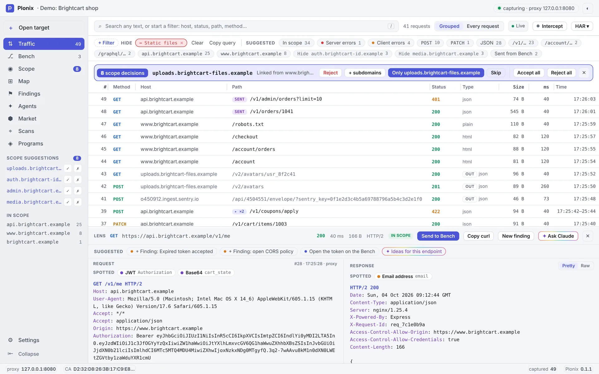
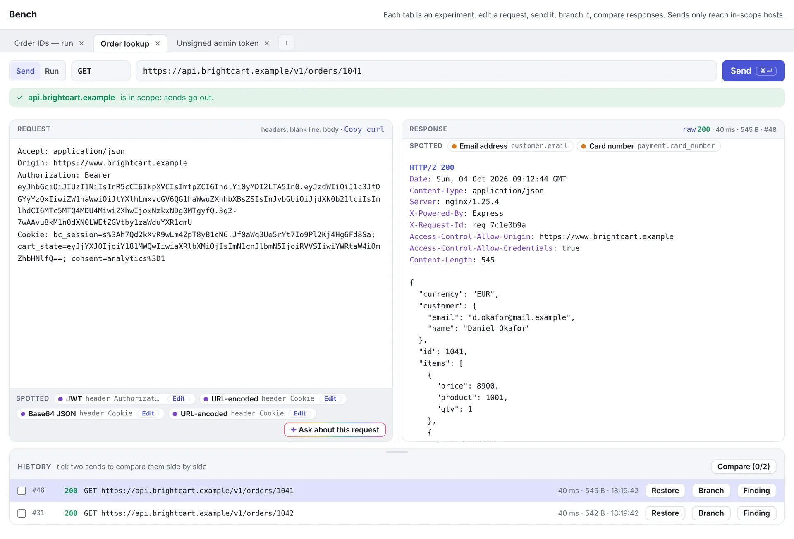
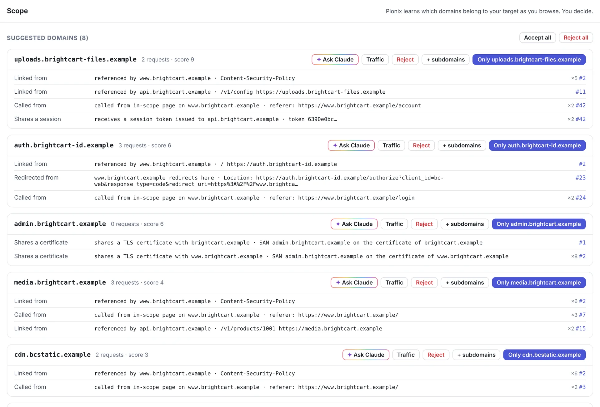
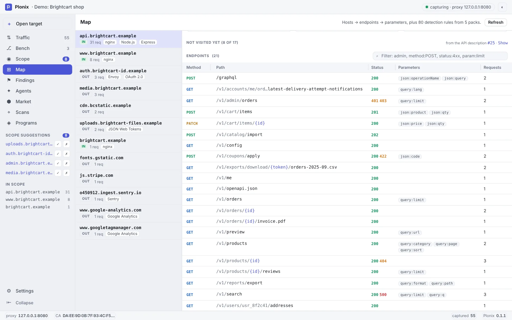
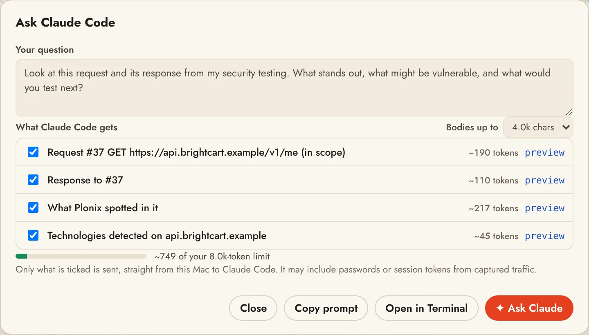

<div align="center">


# Plonix

[](https://plonix.io)
[](https://github.com/SergeyMalych/plonix/actions/workflows/ci.yml)
[](https://github.com/SergeyMalych/plonix/releases/latest)
[](https://github.com/SergeyMalych/plonix/releases)
[](LICENSE)
[](https://github.com/SergeyMalych/plonix/releases/latest)
[](https://www.rust-lang.org)
[](https://plonix.io/docs/)
[](https://github.com/SergeyMalych/plonix/commits/main)
[](https://github.com/SergeyMalych/plonix/stargazers)

**The open-source web security workbench for macOS. Fast, native, and scriptable from day one.**

**[Website](https://plonix.io)** · **[Documentation](https://plonix.io/docs/)** · **[Download for Mac](https://github.com/SergeyMalych/plonix/releases/latest)**

</div>

Plonix captures everything your browser does, learns the real shape of the target as you explore it, and lets you search, replay and prove what you find, from a GUI, a terminal, or an AI agent.

Plonix is an assistant, not an automatic vulnerability finder. It analyzes what you captured and suggests what to look at next; you decide what to send and when. Nothing scans, crawls or fires on its own.

<picture>
  <source media="(prefers-color-scheme: dark)" srcset="docs/images/window-dark.webp">
  
</picture>

> **Status: early, and usable today.** [v0.1.0](https://github.com/SergeyMalych/plonix/releases/latest) is out for Mac. The core engine (proxy, traffic store, search, adaptive scope, local API), the `plonix` CLI, the Plonix app, the Bench with payload runs, the Market, Programs, scope-gated crawl and scans, and read-only MCP access for AI agents work today and are covered by tests. See [Roadmap](#roadmap).

---

## Why Plonix

Most of a web assessment is the same loop: capture traffic, figure out what the app actually is, poke at the interesting parts, and write up what's real. The tools for that loop have grown heavy. Plonix keeps the loop and drops the weight.

| You want | Plonix gives you |
| --- | --- |
| A tool you can afford on every machine | Free and open source. No Pro tier holding back the good parts. |
| Large projects that stay responsive | A Rust engine with one SQLite database per project. Search over captured traffic stays quick as projects grow. |
| Something you can see and click | Plonix.app: a Mac app with its own window, menu bar and Dock icon. Live traffic, the Bench for branching and comparing requests, adaptive scope, a map of the target and findings. |
| Scope that matches reality | Adaptive scope learns related domains as you browse and shows the evidence for each one. |
| Filters you can type | A small query language: `host:api.acme.com method:POST status:5xx -logout`. |
| Automation in any language | Everything goes through a local HTTP API. Use curl, Python, Go, or whatever you already script in. |
| An AI teammate that can see your project | Built-in MCP: `plonix connect claude` lets Claude Code read live traffic, the map, scope and findings. Ask Claude right in the app and watch the answer arrive. Read-only, enforced by the engine. |
| Several targets at once | Each project opens in its own window with its own proxy, database and scope. |
| A toolbox that grows without bloat | A signed community Market of skills, rule packs, filter packs, payload lists, extensions and tools, with a starter set picked for your kind of work. |
| Scope you can keep up with | Follow a bug bounty or disclosure program and its scope and rules apply to everything Plonix sends. |
| A next step without the setup | The Lens reads the request on screen and offers the one move that fits (save a login as a user, check an id across users, replay signed out, scan just this endpoint), one click away. You still decide and send. |

## Principles

- **Fast.** A native Rust core. Projects with lots of traffic stay quick to search.
- **Native.** Built for macOS, not ported to it.
- **Minimal by design.** A few workflows done well: capture, discover, investigate, experiment, validate. No feature you'll never open.
- **User-friendly first.** From download to captured traffic in under a minute is a release requirement.
- **Programmable everywhere.** GUI, CLI and MCP are equal clients of the same local API. Anything you can click, you can script.
- **AI-native.** Agents get first-class, scoped access to the research environment, and they follow the same scope rules you do.

## Tools

Plonix has a handful of tools, each with its own name. They are the same in the window, the CLI and the docs.

| Tool | What it does | From the terminal |
|---|---|---|
| **Traffic** | Every request and response that passes through the proxy, live, with the search language | `plonix search`, `plonix watch` |
| **Lens** | The selected request and its response, decoded and pretty-printed | `plonix show <id>` |
| **Bench** | Where you experiment: edit a request, send it, branch it and compare responses side by side, or run lists of values through marked positions. Each tab is one experiment | `plonix replay <id>`, `plonix bench run` |
| **Scope** | Adaptive scope: the domains Plonix thinks belong to your target, with the evidence, to accept or reject | `plonix scope` |
| **Map** | Hosts, the technologies behind them and their endpoints and parameters | `plonix hosts`, `plonix tech` |
| **Findings** | What you found, with the requests that prove it attached as evidence. Edit, confirm, close and export them as a report | `plonix findings` |
| **Scans** | Crawl a host, review a scan plan for it, and run the scope-gated checks you pick | `plonix crawl`, `plonix scan`, ⌘8 |
| **Agents** | Ask Claude about the whole project, pick up saved conversations, read the notes and leads Claude leaves while you browse (when you turn it on), and see every read an agent made | `plonix connect claude`, `plonix mcp` |
| **Programs** | Bug bounty and disclosure programs: bring one in, and its scope and rules (request rate, required headers, no automated testing) apply to everything Plonix sends | `plonix program`, ⌘9 |
| **Market** | One signed catalog of skills, rule packs, filter packs, payload lists, platforms, tools, bundles and extensions, with picks for your kind of work | `plonix market`, ⌘7 |
| **Extensions** | Sandboxed analyzers that add notes to the Lens and propose findings for you to confirm | `plonix extensions` |
| **Skills** | Playbooks AI agents follow for a job in Plonix, offered over MCP | `plonix skills` |
| **Rules** | Change traffic as it passes: add, change or remove a header, or replace text, for browser traffic, the Bench and Scans, optionally only when a Traffic search matches | `plonix replace` |
| **Rule packs** | Community packs that teach Plonix to recognise technologies | `plonix rules` |
| **Saved users** | The cookies and tokens for each user of an application; the Bench sends as whichever one you pick (a Market tool) | Bench › As … |
| **Access check** | Replays chosen requests as each saved user and signed out, side by side, so differences in what each one may see stand out (a Market tool) | Traffic or Map selection |
| **Callbacks** | Hands out a unique host for each test and lists every DNS lookup, HTTP request or mail that reaches one (a Market tool) | Callbacks tab, Bench › Insert callback host |

## A look around

These are from the demo project that ships with Plonix (Start screen › Try the Demo), so you can open the same screens without a target.

<table>
<tr>
<td width="50%">
<picture>
  <source media="(prefers-color-scheme: dark)" srcset="docs/images/bench-dark.webp">
  
</picture>
<b>Bench.</b> Edit a request, send it, branch it and compare sends. Tokens and encoded values are decoded in place.
</td>
<td width="50%">
<picture>
  <source media="(prefers-color-scheme: dark)" srcset="docs/images/scope-dark.webp">
  
</picture>
<b>Scope.</b> Domains Plonix thinks belong to the target, each with the requests that show why. You accept or reject.
</td>
</tr>
<tr>
<td width="50%">
<picture>
  <source media="(prefers-color-scheme: dark)" srcset="docs/images/map-dark.webp">
  
</picture>
<b>Map.</b> Hosts, what runs on them, and every endpoint with its statuses and parameters. Sort, filter and resize the table.
</td>
<td width="50%">
<picture>
  <source media="(prefers-color-scheme: dark)" srcset="docs/images/ask-dark.webp">
  
</picture>
<b>Ask Claude.</b> See and pick exactly what Claude gets before you ask. The answer arrives in the app.
</td>
</tr>
</table>

## What works today

### Intercepting proxy with a local CA
- HTTP and HTTPS interception. Plonix creates its own certificate authority on first run and mints per-host certificates on the fly.
- Trust the CA once (`~/.plonix/ca.pem`) and every HTTPS site you visit through the proxy is captured.
- Compressed bodies (gzip, deflate, brotli) are decoded for display and search.
- Bodies stream through: event streams, long polls and large downloads reach the browser as the server sends them. Plonix keeps the first 10 MB of each body (Settings › Proxy › Keep bodies up to), and the Lens and `plonix show` say when a body was cut and how big it was.
- HTTP/2 on both sides: browsers can speak HTTP/2 to the proxy inside decrypted HTTPS, and servers that offer HTTP/2 are reached over it (others over HTTP/1.1), through an upstream proxy too. Each request records the protocol it used, shown in the Lens and `plonix show`; replays from the Bench use it as well.
- WebSockets work through the proxy, over plain HTTP and inside decrypted HTTPS. Every message (text, binary, ping, pong, close, in both directions) is recorded against its handshake: reassembled from fragments, unmasked and decompressed. The Lens lists them under the handshake, `plonix show` prints them, and `GET /api/traffic/{id}/messages` returns them.

### Intercept: hold, edit, forward or drop
- **Intercept** in the Traffic toolbar (or `i`, or `plonix intercept on`) holds requests passing through the proxy so you can look at each one before it goes on. Held items wait in a panel above the traffic list: edit the request as text (start line, headers, body) and **Forward** (⌘↵ or `f`), **Drop** it (`d`; the browser gets an error page), or **Forward all**. A count on the button and on Traffic in the sidebar says how many are waiting.
- By default only in-scope hosts are held; Settings › Intercept switches to everything, narrows it with a Traffic search such as `method:POST path:/api`, and turns on **responses** too, so you can edit what the browser gets. Compressed response bodies are shown decoded and sent uncompressed when changed.
- Nothing waits forever: an item nobody answers goes on unchanged after 5 minutes (configurable), and turning Intercept off sends everything held on. Intercept is off whenever a project opens.
- HTTP/2 requests are shown and edited in HTTP/1.1 form. A body longer than the body limit, still arriving, or not text cannot be edited: its start line and headers can, and the body goes through as it is. WebSocket messages, hosts that are never decrypted, the proxy's own pages and Plonix's own requests (Bench, scans, crawls without a browser) are never held. A browser crawl goes through the proxy, so with Intercept on its requests wait like the rest.
- The record shows what was actually sent, marked **edited**, with the original kept: the Lens shows it on click, and `GET /api/traffic/{id}` returns it as `original_request` / `original_response`.
- Intercept is yours alone: agents cannot see the queue or hold, edit, forward or drop anything.

### Rules
- Rules change traffic as it passes, in plain steps: **Add header** (send a header on every request, such as your bug bounty handle), **Change header**, **Remove header**, or **Replace text** in the request line, headers or body, or in the response headers or body. Use them to send an identity header, swap a token, strip `Content-Security-Policy`, or flip a feature flag in a JSON response.
- Each rule says where it applies: traffic from your browser, requests you send from the Bench (and Run and Access check), and requests Scans send. A rule can be limited to in-scope hosts and can have a condition, written as a Traffic search (`host:api.example.com method:POST`): it only changes what matches.
- The **Rules** screen lists every rule in plain words, with a switch per rule and one switch that pauses them all; **+ Add rule** opens a short form with a preview of what every request will carry. Right-click any header in the Lens to start a rule from it, filled in. A pill in Traffic shows how many rules are on and pauses them in one click.
- Text rules match literal text or a regular expression (`$1` puts back what a group matched). Body rules apply to bodies within the body limit; longer, streaming and event-stream bodies pass unchanged. Compressed response bodies are matched decoded and sent uncompressed when changed. WebSocket handshakes and messages are not changed.
- Each exchange records which rules changed it and the request as it was: Traffic and the Lens mark it **changed**, and the Lens shows it as sent, as it was, or side by side. Also with `plonix replace` (`plonix replace header add X-Bug-Bounty me --bench --scans`) or `/api/replace`. Agents cannot read or change rules.

### Full traffic capture
- Every request and response is recorded into a per-project SQLite database, in scope or not, so nothing you browsed is lost.
- Hosts and the endpoints seen on each host are listed for a quick map of the target.

### HAR files
- **HAR ▾** in the Traffic toolbar exports all traffic, the current filtered view, or rows you pick (⌘-click or Ctrl-click, Shift-click for a range) to a standard HAR 1.2 file: headers, cookies, bodies (base64 when binary), timings, WebSocket messages and the client certificate used. In the app, File › Import HAR… and Export Traffic as HAR… open a native file dialog.
- Importing a HAR file (from a browser's developer tools, a teammate or another project) adds its requests to the project as traffic marked **HAR**. They go through scope suggestions and detection like captured traffic, entries the project already has are skipped, and `source:import` finds them.
- From the command line: `plonix har export host:example.com status:5xx -o errors.har` and `plonix har import capture.har`. Files are read and written as a stream, so large ones are fine. See [docs/projects.md](docs/projects.md#har-files).

### Client certificates
- Servers that ask for a client certificate (mutual TLS) get one: add a certificate per host, or for `*.example.com`, as PEM (certificate chain and key) or a PKCS#12 `.p12` / `.pfx` file with its password. It is used by the proxy, the Bench, scans and crawls.
- Manage them in Settings › Client certificates (one switch stops presenting them all) or with `plonix certs add api.example.com --cert client.pem --key client-key.pem`, `plonix certs list` and `plonix certs remove`. Keys stay in the project's database and are never shown again, logged, or given to agents.
- The Lens and the Bench mark exchanges that presented a certificate, and when a server asks for one you haven't added, the error says so. See [docs/projects.md](docs/projects.md#client-certificates).

### Fast search with filters
Field filters narrow by metadata, and anything else is full-text matched (case-insensitive) against URLs, headers and decoded bodies. Every term is an include (show only what matches) and a leading `-` makes it an exclude (hide what matches). Separate values with commas to match any of them: `status:4xx,5xx -kind:static -host:cdn.example.com`.

```text
host:example.com          host or any subdomain (globs: host:*.cdn.*)
method:POST               HTTP method
status:404  status:5xx    exact code, class, or status:none for no response
path:/api                 path prefix (globs: path:*admin*)
ext:js                    file extension of the path
kind:static               images, fonts, stylesheets, scripts and media
mime:json                 substring of the response content type
scope:in  scope:out       in or out of the current scope
source:proxy              captured traffic, source:replay for sent requests, source:import for HAR imports
"set-cookie: sid"         quoted phrase
passw -logout             plain full-text terms
```

You don't have to remember any of it. As you type, a list under the search box offers the fields first, then the values this project actually has (hosts, status codes, paths, content types, named filters), each with how many requests match. ↑↓ picks, Tab completes, Enter adds it as a filter chip. A leading `-` carries through, so `-host:` suggests hosts to hide, and after a comma (`status:4xx,`) it offers the rest.

### Adaptive scope
Static whitelists assume you already know every domain an app uses. You don't. You find out by using it. Plonix records everything, then suggests domains to bring into scope, each backed by evidence:

| Evidence | Example |
| --- | --- |
| Called from an in-scope page | `Referer` or `Origin` points at an in-scope host |
| Redirect | An in-scope host redirects here (`Location:`) |
| Linked | Referenced in an in-scope page or its `Content-Security-Policy` |
| Shares a session | Receives a session token that an in-scope host issued |
| Shares a certificate | Appears in the TLS certificate SANs of an in-scope host, or the reverse |

You accept or reject each suggestion (`*.example.com` covers all subdomains). Accepting a domain re-analyzes past traffic, so new suggestions surface right away. **Accept all** and **Reject all** list every domain with a checkbox first, so you can leave some out; unchecked domains stay pending.

**Enforcement is built in.** Every active request, whether a replay, a crafted request, or one from an agent, passes a single choke point. If the target host isn't accepted, it is refused. Passive capture keeps recording everything.

### Replay and send
- Replay any captured exchange with a different method, path, headers or body.
- Send new requests from scratch. Results are stored alongside captured traffic and tagged with who sent them.

### Bench runs
- Mark one or more positions in a request with `•…•` and feed lists of values through them: one position at a time, in lockstep, or every combination. Lists come built in, from the Market, from a number range, from values you type or from a file.
- Results line up in one table (status, size, time, and what changed against the baseline), and every row opens its full response. Every request goes through the scope choke point, is capped by a request budget, and is recorded like any other send. A run only starts when you start it; agents cannot start one.
- From a terminal: `plonix bench run 'https://example.com/api/items/•1•' --list range:1-200 --base`. See [docs/bench.md](docs/bench.md).

### Technology detection, maintained by the community
- Plonix recognises what runs behind every host (servers, frameworks, CMSs, CDNs and WAFs, identity providers, exposed admin consoles) and shows the evidence for each detection, down to the exchange.
- Detection is driven by declarative **rule packs** that anyone can write and share. Install them from a file, a URL or the **Market**. New rules apply to traffic you already captured.
- Packs are untrusted data: strictly validated, linear-time patterns only, pinned by SHA-256 and re-verified on load. They can't run code, reach the network or touch scope. See [docs/detection-rules.md](docs/detection-rules.md) and the extension design in [docs/extensions.md](docs/extensions.md).
- **Filter packs** add named filters such as `is:auth`, `is:graphql` or `-is:trackers` to search, the CLI and the **+ Filter** builder in Traffic. Plonix ships a `common` pack, and the Market has more. See [docs/filters.md](docs/filters.md).

### Sandboxed extensions
- **Extensions** are small WebAssembly analyzers the community writes. One reads the traffic Plonix hands it (in-scope hosts only, unless you allow more), adds notes that show in the Lens under its own name, and proposes findings that stay open until you confirm them.
- They run in a sandbox with no network, files, processes or clock, and a CPU, memory and time budget. One that crashes or runs away is stopped and switched off with a message; Plonix carries on.
- Install from a file, a folder or the signed Market, after seeing what each one may do. Switch them on and off, run one over traffic you already captured, remove it. See [docs/extensions.md](docs/extensions.md) and the example in [examples/extensions/security-headers](examples/extensions/security-headers).
- Beyond analyzers there are three more kinds: **scan** (runs a command-line tool you install, on your Mac only, over captured traffic), **enumerate** (a tool you install finds subdomains, added to Scope as suggestions to review; scope never changes on its own) and **probe** (Plonix itself sends a bounded set of candidate inputs through the same scope-gated path as a replay; nothing to install).
- In the Market today: **secret-sweep** (API keys, tokens and passwords for hundreds of services, using `trufflehog` you install yourself), **js-endpoints** (API paths and URLs referenced in captured JavaScript), **subdomain-discovery** (subdomains of an accepted domain from public sources, using `subfinder` you install), **parameter-probe** (undocumented query parameters on one in-scope endpoint), **graphql-explorer** and **security-headers**.

### The Market and starter profiles
- **One signed catalog** (`store/index.json`) of skills, rule packs, filter packs, payload lists, bug bounty platforms, tools, bundles and extensions. Everything is verified against the signature before it installs, and items added from a file or link are marked **Not verified**.
- **Tools** switch on a capability built into Plonix that ships off until you want it, such as Saved users, the Access check and Callbacks.
- **Starter profiles:** pick bug hunter, red teamer or security researcher on the Start screen, at the top of the Market, in Settings or per project. The Market then shows **Recommended for you**, each item with one line on why, and `plonix market install --starter` installs the set. Pick none and everything stays neutral. See [docs/market.md](docs/market.md).

### Saved users and the Access check
- **Saved users** keep each user's cookies and tokens per project. Pick **As …** on the Bench to send a request as one of them; switching never widens scope.
- The **Access check** replays the requests you select in Traffic or on the Map as each saved user and once signed out, then lines up status, size and content for each. It points out where a signed-out request still succeeds and where different users get the same response; it draws no conclusions, and you decide what they mean.

### Callbacks
- **Callbacks** hand out a unique host for each test. Put one in a request (Bench › **Insert callback host** puts it where the cursor is) and every DNS lookup, HTTP request or mail that later reaches it is listed with its time, sender and raw request, next to the test it came from. **Find the request** shows the captured request that carried the host, and **+ Finding** writes it up with both as evidence.
- Listening starts only when you press **Start listening** and talks only to the callback server: the public servers, or your own with a token. It uses [interactsh](https://github.com/projectdiscovery/interactsh), the open-source callback tool by ProjectDiscovery (MIT license), which you install with `brew install interactsh`. Plonix keeps each project's session so earlier hosts keep working after a restart.

### Programs
- **Programs** (⌘9, `plonix program`) bring in a bug bounty or vulnerability disclosure program: connect HackerOne, paste a program's policy, or look up a domain's `security.txt`, then review and follow it.
- With a platform connected, Plonix syncs every program you can work on, with its assets and rules, so you can search them by program or by asset. It tells you when a followed program's scope changes. Platform tokens stay in the macOS Keychain and are never given to agents.
- Following a program sets the project's scope from its assets (in-scope assets accepted, listed exclusions rejected, IP ranges as rules), and its rules apply to everything Plonix sends: at most the program's request rate, the headers it asks for, and no scans, crawls or Bench runs when it bans automated testing.
- Platforms are declarative Market packages, so more can be added without a Plonix release. See [docs/programs.md](docs/programs.md).

### Projects, side by side
- **A project is a folder you choose.** It holds the project's traffic, scope and findings (`traffic.db`), its settings (`plonix-project.json`) and its own capture-browser profile. Move or copy the folder and open it again; it just works. New projects go in `~/Plonix` unless you pick another folder.
- **Open several projects at once.** Each open project runs its own session: its own proxy port (8080, then 8081, 8082…), its own API and its own database. Nothing collides, and a project is never opened twice. All projects share one certificate, so you trust it once.
- **The Start screen** lists your projects with their folders, whether they are open and on which proxy port. Create a project (with a folder picker), open one, change its settings, rename it, show its folder or remove it from the list.
- **Keep only in-scope traffic** (Settings › Storage, per project): when the project closes, Plonix deletes traffic to every host that is not in scope and compacts the file, so it is gone from disk. Requests your findings point to are kept, and if nothing is in scope yet, nothing is deleted. If Plonix quits unexpectedly, the clean-up runs the next time the project opens. See [docs/projects.md](docs/projects.md).

### Settings
- **Proxy** (per project, applies right away): listen address and port (use 0.0.0.0 to capture from phones and other devices), next-free-port fallback, HTTPS decryption on or off, hosts that are never decrypted (for apps that pin certificates), server certificate checks, an upstream HTTP or SOCKS5 proxy with login and a list of hosts to reach directly, timeouts, and how much of each body to keep.
- **Intercept** (per project): hold in-scope hosts only or everything, an optional Traffic search to narrow what is held, whether responses are held too, and how long an unanswered item waits before it goes on unchanged.
- **Match and replace** (per project): one switch that pauses every rule; the rules themselves are on the Rules screen.
- **Client certificates** (per project): certificates presented to servers that ask for one, and one switch that turns them all off.
- **Storage** (per project): keep only in-scope traffic, with a count of what it would delete and a button to delete it now.
- **Interface** (all projects): open projects in a Plonix window or in your web browser.
- **Appearance** (this Mac): theme (match the system, light or dark) and spacing. **Dense**, the default, fits more on screen; **Roomy** gives rows and panels more air.
- **Usage statistics** (all projects): share anonymous feature counts once a day, or not. See [Privacy](#privacy).
- Settings are a registry: a feature adds a section by describing its fields, and the Settings screens draw it with validation and storage included (see [docs/projects.md](docs/projects.md#adding-a-settings-section)).

### The Plonix app
- **Plonix.app** is a Mac app: double-click it and the Start screen opens. Pick or create a project and it opens in a window of its own, with capture running. Open more projects and each gets its own window. Closing a project's window closes its session. No terminal needed.
- With Settings › Interface › **Open projects in: My web browser**, projects open in your default browser instead; View › Open in Browser (⇧⌘B) does it for one window.
- **Open target** (⌘O, or the button at the top of the sidebar) opens the site you are testing in the capture browser: a separate browser with an isolated profile that routes through Plonix and trusts its certificate. The domain and its subdomains go into scope.
- **Works on every Mac.** With no Chrome, Brave, Edge or Firefox installed (a Safari-only Mac), Open target offers **Get the Plonix browser**: one click downloads Chromium (Google's Chrome for Testing build, about 150 MB, once) into `~/.plonix/chromium`, with a progress bar and a retry if the download fails, and then opens the target in it. Nothing is bundled with the app, so Plonix.app stays small.
- **Firefox users** get a one-click **Trust the Plonix certificate** right after Open target, shown only while the certificate is not trusted yet. It adds the certificate to your login keychain (macOS asks for your password or Touch ID); the capture profile makes Firefox follow the keychain, so HTTPS works after a reload.
- **Plonix › Install Command Line Tool…** puts the `plonix` command on your PATH (`/usr/local/bin/plonix`, linked to the tool inside Plonix.app, so it updates with the app). macOS asks for an administrator password only when that folder needs it. Uninstall Command Line Tool… removes it again. See [docs/setup.md](docs/setup.md) for all three.
- Native menu bar and shortcuts: ⌘N new project, ⇧⌘P the Start screen, ⌘, Settings, ⌘1 to ⌘9 switch between Traffic, Bench, Scope, Map, Findings, Agents, Market, Scans and Programs, ⌃⌘S shows or hides the sidebar. Light and dark follow the system unless you pick one in Settings › Appearance.
- `plonix` commands in a terminal talk to the same sessions while the app is open (`-p` picks the project), and projects started from a terminal show up on the Start screen. Quitting the app closes the projects it opened.
- The same window also runs in any browser with `plonix ui`, served by the engine itself.
- **Updates are your call.** Plonix asks once whether to check for new versions (daily, weekly, at launch or only when you ask) and never installs anything by itself: downloading and installing each need a click, and closing a dialog means no. See [docs/updates.md](docs/updates.md).
- **Crash reports stay on your Mac.** If Plonix crashes, it saves a report in `~/.plonix/crashes/` with addresses, headers, tokens and your user name removed, and sends nothing. The next launch asks whether to view it, open a pre-filled GitHub issue for you to review and submit, or dismiss it; `plonix` prints where the report is. See [docs/crash-reports.md](docs/crash-reports.md).

### The Plonix window
- **Sidebar:** navigation, Open target, the scope suggestions waiting on you (accept or reject in one click) and the hosts in scope with their request counts (click one to filter Traffic). Collapse it to icons with ⌃⌘S, or `\` in a browser.
- **Traffic:** a live-updating request list with the search language and the **Lens**, an inline request/response viewer that decodes gzip/brotli and pretty-prints JSON. A banner surfaces each new domain adaptive scope suggests, with its evidence and one-click accept or reject.
- **Look-alike grouping:** Traffic offers to fold requests to the same path with different ids into one row each. Click a group to see every request in it, or turn grouping off to see each request on its own row.
- **Repeats folded:** the same request sent several times in a row shows as one row with its count (×N) and the time from first to last. Click it to see each one, or pick **Every request** in the toolbar.
- **Include and exclude filters:** filters sit as chips above the list, under **Show only** and **Hide**. Add one with **+ Filter**, in one click from the suggestions drawn from your traffic (hide static files, hide the busiest third-party hosts, show only errors), or right-click any row to show only or hide its host, path, status class, content type, extension or method. Click a chip to flip it between show and hide, × to remove it. Filters typed in the search box become chips, and **Copy query** gives the same filters as a query for the CLI or the API. Active filters are saved with the project.
- **Spotted in the Lens:** Plonix points out what stands out in a request or response, right above it. JWTs (header and payload decoded, algorithm, expiry; the signature is never claimed valid), Base64, hex and double URL-encoding that decode to readable text, Basic auth credentials, personal data (email addresses, Luhn-valid card numbers), leaked secrets (AWS, Google, GitHub, Slack and Stripe keys, private keys) and internal IP addresses. It also spots stack traces in responses. Click one to highlight it in place and see the decoded value, then copy it or find it across all captured traffic. Nothing is flagged unless it is there, and detection runs locally on traffic you already captured. Select any text in the Lens yourself to decode it (JWT, URL-encoding, Base64, hex), find it across traffic or ask Claude about it.
- **Next steps in the Lens:** when something stands out (a leaked secret, an unsigned or expired token that still works, a card number, many people's email addresses, a stack trace, a server error), the Lens offers to record a finding, and **Ideas for this endpoint** asks Claude what to try. **Copy as curl** works from the Lens, the Traffic right-click menu and the Bench.
- **Quick actions that read the request:** the Lens **Suggested** row and the Traffic right-click menu offer the one next step that fits what is on screen. A response that sets a session offers **Save login as a user**; an id in the path offers **Check this id across users**; a signed-in request that worked offers **Replay signed out**; a reflected value, a redirect or a GraphQL call opens on the Bench ready to vary; an open CORS policy drafts a finding; a stack trace or 5xx finds others like it from that host. A file upload, an input that looks like a URL or host the server fetches, or any endpoint with inputs offers to open **Scans focused on that one endpoint**, with the fitting checks picked. Hand-offs into Scans and other tabs are offered only for hosts in scope, anything that sends goes through the scope check, and nothing is sent until you click.
- **AI actions stand out:** every Ask Claude button and Claude-written suggestion has a soft rainbow frame, so you can tell at a glance which actions go to Claude.
- **Bench:** edit any request and send it (press `b` or double-click a row in Traffic), keep a history per tab, restore or branch any earlier send into a new tab, and compare two sends side by side (response or request diff). Sends go through the engine's scope enforcement: out-of-scope hosts are refused, and you can accept the host right there.
- **Editable Lens on the Bench:** JWTs, URL-encoded and Base64 values in a draft are decoded in place; edit the decoded value and the request is rewritten with it. When a send comes back logged out but worked before, the Bench offers the newest login captured for that host, for that tab or every tab still on the old one.
- **Scope:** every suggested domain with its evidence, accept (with or without subdomains) or reject, and the rule list. Common third parties (analytics, ads, payments and the like) can be kept out in named groups, switched as a set, alongside groups you define.
- **Map:** hosts with their scope state, detected technologies with the evidence behind them, and endpoints with statuses and parameters. Numbers in paths fold into `{id}` and long opaque segments (signed links, session tokens, JWTs) into `{token}`, so every link to the same resource is one endpoint, and long paths stay on one line with the resource name readable. Resize columns by dragging their edge, sort by clicking a title, and filter with plain words or `method:`, `path:`, `status:` and `param:` terms. When an API description (OpenAPI or Swagger) shows up in traffic, the Map lists the endpoints nobody has visited yet, each one click from the Bench.
- **Findings:** record a finding from any request, with the requests that prove it linked as evidence. **Write it with Claude** drafts it for you (a plain-words title, severity with the reason, what happens, why it matters, steps to reproduce and the request as curl), and nothing is saved until you press Save. Edit its title, severity and description, set its status (open, confirmed, false positive, fixed) and delete it after a confirmation. **Export** saves the findings as a report in Markdown, a self-contained HTML page or JSON, each finding with its evidence requests and responses (bodies clipped to 4,000 characters). Reports leave false positives out unless you ask for them.
- **Agents:** where you work with Claude on the project as a whole. Ask about the whole project or start a skill in one click; every question asked here or with Ask Claude anywhere is saved as a conversation you can reopen and follow up on. Turn on **Watch my traffic** and Claude reads new in-scope traffic when you pause and leaves a digest, notes and leads, each with one place to act on it (the Lens, the Bench, a focused scan, an access check, a draft finding); the sidebar counts unread items, and it stops for the day at a token limit you pick. An activity feed lists every read an agent made, in plain words. Setup (connect command, agent settings, what agents may do) sits behind one button.
- **Suggested filters** come from the traffic you captured: in-scope only, server and client errors, the write methods in use, JSON, the busiest API paths and hosts, requests sent from the Bench, and one chip that hides static files. Each shows how many requests it matches, and a filter only appears when something matches it.
- **Demo project:** Try the Demo on the Start screen opens a made-up shop's traffic with scope, findings and Bench experiments ready, and offers a short walkthrough that rings each part of Plonix on screen. Take it again any time from **Take the tour** in the demo strip.
- The page signs in through a one-time link (the app and `plonix ui` create it), so the API token never appears in a URL. It is locked down with a strict Content-Security-Policy, and captured content is only ever rendered as text.

### AI agents over MCP
- `plonix connect claude` adds Plonix to Claude Code as an MCP server. From then on Claude Code can search your captured traffic, read requests and responses, see hosts, endpoints and detected technologies, review scope suggestions, and read findings or export them as a report, on the live project.
- Access is **read-only and enforced by the engine**: agents sign in with their own token (`~/.plonix/agent-token`), and anything but reading (sending or replaying requests, changing scope, recording, editing or deleting findings) is refused. The one thing an agent can leave is a suggested edit to a Bench request, which only you can apply.
- **Ask Claude** on a request, finding, host or scope suggestion hands Claude Code just that spot's context as a prompt you review first. Plonix clips the bodies, shows what will be shared, and warns before sending more than your context limit.
- **Answers arrive in the app.** Plonix runs the `claude` command on your Mac, wired to the same read-only MCP server and nothing else (your other MCP servers and Claude Code's shell, file and web tools are switched off for these runs), and shows its progress as it works: the current step, tokens read and written, elapsed time and the answer as it is written, formatted with headings, lists, tables and code blocks you can copy. A run that goes quiet says so and is stopped with a clear message instead of hanging.
- **Suggested edits on the Bench:** ask Claude about a request you are editing and it can propose a concrete edited request. The Bench shows it as a diff against your draft (request line, headers, body, with query strings, form fields, JSON and JWTs decoded) with **Apply** and **Discard**. Nothing changes until you apply it, applying only changes the draft, and sending stays your click. An edited JWT keeps its original signature and is marked unsigned.
- Any other MCP client can run `plonix mcp` as a stdio server. Captured data stays on your machine. See [docs/agents.md](docs/agents.md).

```sh
plonix open example.com      # capture while you browse
plonix connect claude        # once
claude                       # then ask:
```

> Use Plonix to find in-scope API endpoints that returned errors, then read the most interesting request and tell me what stands out.

### Scanning and crawl
- **Crawl** a host to discover its endpoints, parameters and forms (`plonix crawl example.com`). It starts from the traffic you captured, follows same-host links within a page and depth budget, and never submits a form.
- **Crawl with a browser** for JavaScript apps (`plonix crawl --browser https://app.example.com/`, or **Use a browser** on the Scans screen). Pages render in a headless copy of your Chrome, Chromium, Brave or Edge, on a throwaway profile, routed through Plonix so every request lands in Traffic and on the Map. Links come from the rendered page and the app's own routes; requests to hosts outside scope are blocked inside the browser, forms are never submitted, and with `--click` it also clicks buttons that do not look destructive (never log out, delete, pay and the like).
- **Scan plan:** `plonix scan plan example.com` (or `GET /api/scan/plan/{host}`) analyzes a host and lists the tests that apply to it, each with the reason, grouped by OWASP category, for you to review. It sends nothing.
- **Focused on one endpoint:** a quick action in the Lens or Traffic opens Scans narrowed to that endpoint, with the checks that fit it picked; **Scan the whole host** clears the focus. You review and press Run.
- **Active scans** run checks chosen from the target's fingerprint: a check only runs where its detector found something it applies to, so checks that cannot apply are never sent. `plonix scan suggest example.com` shows the suggested profile without sending anything, and `plonix scan run example.com` runs it.
- The built-in checks are benign (exposed `.git/config` and `.env`, `server-status`, a harmless reflection marker). Intrusive checks are off unless you turn them on for a scan, and every scan is capped by a request budget.
- Every scan and crawl request goes through the same scope choke point as a replay, so it can only reach hosts you accepted, and it is recorded in Traffic. Nothing scans on its own: a person starts every scan, and agents cannot. Findings land in Findings with the requests that prove them. See [docs/scanning.md](docs/scanning.md).

### Local API
- An HTTP API on loopback only, protected by a bearer token stored at `~/.plonix/api-token` (mode `0600`).
- Requests must target the loopback address, which keeps web pages in your browser from reaching it.

## Quickstart

### Download

Download **[Plonix for Mac](https://github.com/SergeyMalych/plonix/releases/latest/download/Plonix-macOS.dmg)** (Apple silicon and Intel, macOS 11 or later), open it and drag Plonix to Applications. Every release is listed on the [releases page](https://github.com/SergeyMalych/plonix/releases), with what changed in [CHANGELOG.md](CHANGELOG.md).

Releases are not notarized by Apple yet, so macOS asks before opening Plonix the first time: open it, click **Done**, then go to **System Settings › Privacy & Security** and click **Open Anyway** next to Plonix. Or run `xattr -dr com.apple.quarantine /Applications/Plonix.app` once.

### Build from source

Requirements: Rust (stable, edition 2024) and a C toolchain. On macOS, `xcode-select --install` is enough. SQLite is bundled.

```sh
git clone https://github.com/SergeyMalych/plonix.git
cd plonix
cargo install --path crates/plonix-cli    # installs the `plonix` command
```

Build and open the app (needs the Rust toolchain above):

```sh
cargo install tauri-cli --version "^2" --locked   # once
cd crates/plonix-app
cargo tauri build --bundles app
open ../../target/release/bundle/macos/Plonix.app
```

Drag `Plonix.app` to Applications to keep it. While developing, `cargo run -p plonix-app` opens the same window without bundling.

Release and CI builds carry the `plonix` command inside the app for **Install Command Line Tool…**: they build it first and put it in `crates/plonix-app/binaries/plonix-cli-<target>` (see `.github/workflows`). A local build without it gets a stand-in, and the menu item then points you to `cargo install --path crates/plonix-cli`. To include it yourself: `cargo build --release -p plonix && mkdir -p crates/plonix-app/binaries && cp target/release/plonix crates/plonix-app/binaries/plonix-cli-$(rustc -vV | sed -n 's/^host: //p')` before `cargo tauri build`.

Each CI run on `main` and on pull requests also builds `Plonix.app` and attaches it as a download (`Plonix-macOS`). Builds from `main` are signed and notarized once the project's signing is set up ([docs/releasing.md](docs/releasing.md)); until then, and for pull requests, they are unsigned: the first time, right-click the app and choose **Open**, or run `xattr -dr com.apple.quarantine Plonix.app`.

### The first 60 seconds from a terminal

```sh
plonix open example.com
```

The very first `plonix` command asks you to accept the license and terms (see [Privacy](#privacy)). Then that one command creates your local certificate authority (first run only), starts the engine in the background, puts `example.com` and its subdomains in scope, opens a browser at the target with capture running, and opens the Plonix window next to it:

```text
Plonix · https://example.com/

  ✓ Certificate  ~/.plonix/ca.pem  (created)
  ✓ Proxy        127.0.0.1:8080  (started, project example.com)
  ✓ Scope        example.com (+ subdomains)  (more domains are suggested as you browse)
  ✓ Browser      Google Chrome (isolated profile, trusts Plonix)
  ✓ Window       http://127.0.0.1:8090  (opened in your default browser)

Capturing. Browse the site; requests appear below. Ctrl-C stops watching, capture keeps running.
```

The browser is Chrome, Brave, Edge or Chromium with its own isolated profile. It routes through the proxy and trusts the Plonix certificate on its own, so HTTPS works with nothing to install. With none of those installed, `plonix open` offers to download the Plonix browser (Chromium, about 150 MB, once; or run `plonix browser install`). Firefox is used when no Chromium-based browser is available; it needs the certificate trusted once (`plonix ca trust`). Set `PLONIX_BROWSER` to pick a specific browser, and `plonix browser` shows which one Plonix uses.

To capture HTTPS from other apps too (Safari, curl, your everyday browser), trust the certificate once with `plonix ca trust`. It is added to your login keychain, and macOS asks you to confirm.

Browse the site and watch requests arrive in the Plonix window. Closed it? `plonix ui` opens it again (and starts the engine if it is not running). `plonix ui --no-open` prints the one-time link instead, and `plonix open --no-ui` skips the window.

### Working from the terminal

```sh
plonix status                              # is it running, what has it captured
plonix search host:example.com status:5xx  # newest first; filters below
plonix show 42                             # one request and its response
plonix watch scope:in                      # print new traffic as it arrives
plonix hosts                               # every host seen, busiest first
plonix tech                                # technologies detected on each host, with evidence
plonix crawl example.com                   # discover endpoints, parameters and forms (accepted hosts only)
plonix crawl --browser example.com/app     # the same in a headless browser, for JavaScript apps
plonix scan suggest example.com            # the checks that apply to this host; sends nothing
plonix scan plan example.com               # a reviewable plan of tests, with reasons; sends nothing
plonix scan run example.com                # run them
plonix bench run 'https://example.com/api/items/•1•' --list range:1-200   # a Bench run

plonix scope                               # rules, plus suggested domains with evidence
plonix scope review                        # decide on suggestions one by one
plonix scope accept '*.example-cdn.com'    # or: reject, remove

plonix replay 42 -H 'Authorization: Bearer other-user' -t '/api/users/2'

plonix intercept on                        # hold requests to in-scope hosts (--everything, --filter, --responses)
plonix intercept list                      # what is held, oldest first
plonix intercept forward 3 --edit          # edit in $EDITOR, then send on; or: drop 3, forward-all
plonix intercept off                       # stop holding; anything held goes on unchanged
plonix replace add request-header '(?i)^user-agent: .*$' 'User-Agent: plonix' --regex
plonix replace add response-body '"debug":false' '"debug":true' --in-scope
plonix replace                             # the rules in order; or: enable 2, disable 2, rm 2

plonix findings                            # what you found, most severe first
plonix findings add 'IDOR on /api/users' -s high -r 42,43
plonix findings show 1                     # one finding with its evidence requests
plonix findings edit 1 -d @notes.md        # or --title, --severity
plonix findings status 1 confirmed         # open, confirmed, false-positive, fixed
plonix findings rm 2                       # asks first; the requests stay
plonix findings export -o report.html      # or .md, .json; false positives left out

plonix rules                               # detection rule packs in effect
plonix rules add ./my-pack.json            # or an https:// URL, optionally --sha256
plonix filters                             # named filters: is:auth, is:graphql, -is:trackers
plonix market                              # skills, rules, filters, bundles, extensions
plonix market install api-kit              # a bundle: verified against the signed index
plonix market profile bug-hunter           # or red-teamer, researcher, none
plonix market recommend                    # what suits your kind of work
plonix program follow hackerone:acme       # show what following a program changes; --yes applies it
plonix program sync hackerone              # pull every program you can work on (after: program connect)
plonix skills                              # playbooks your agent can follow
plonix extensions add ./my-extension       # a sandboxed analyzer; shows what it may do first
plonix stop                                # captured traffic is kept

plonix start -p shop                       # open another project; it gets its own proxy
plonix sessions                            # projects open right now, with their ports
plonix -p shop search status:5xx           # -p (or $PLONIX_PROJECT) picks the project
plonix projects                            # every project and its folder
plonix projects new "Acme staging" --location ~/work
plonix projects demo                       # a ready-made project to explore Plonix with
plonix launcher                            # the Start screen, in your browser
plonix stop --all
```

Replays only go to accepted hosts. Anything else is refused with exit code 4 and a hint to accept the host first. Every command takes `--json` for scripting. Exit codes are `0` ok, `1` error, `2` bad usage or query, `3` engine not running, `4` refused by scope, `5` not found.

`plonix start` opens a project without opening a browser (`-p`, `--port`, `--insecure-upstream` for self-signed staging hosts). Without `-p`, commands talk to the current session: the project opened last. Projects live in their own folders; Plonix's own files (certificate, token, the list of projects, shared settings) live in `~/.plonix`, or `$PLONIX_HOME`.

### Using the local API directly

Everything the CLI does goes through the local API, so any language can drive Plonix:

```sh
TOKEN=$(cat ~/.plonix/api-token)
API=http://127.0.0.1:8090/api

curl -H "Authorization: Bearer $TOKEN" "$API/status"
curl -H "Authorization: Bearer $TOKEN" -G "$API/traffic" --data-urlencode 'q=host:example.com status:2xx'
curl -H "Authorization: Bearer $TOKEN" "$API/scope"     # rules plus suggestions with evidence

curl -H "Authorization: Bearer $TOKEN" -H 'Content-Type: application/json' \
     -d '{"domain":"*.example.com"}' "$API/scope/accept"
```

The API listens on port 8090 when it is free; `plonix status` shows the actual address.

### API at a glance

| Method | Path | What it does |
| --- | --- | --- |
| GET | `/` | The Plonix window (static page; signs in with a one-time link) |
| POST | `/api/ui/launch` | Create a one-time link that opens the window signed in |
| POST | `/api/browser/open` | Open a target in the capture browser (`{"target": "example.com"}`), accepting it into scope. Answers `no_browser` (with `can_install`) when there is none, and `needs_trust` when the browser needs the certificate trusted |
| GET | `/api/browser` | The browser Open target uses, the Plonix browser and its download progress, whether the certificate is trusted |
| POST | `/api/browser/install` | Start downloading the Plonix browser (Chromium); follow it with `GET /api/browser` |
| POST | `/api/ca/trust` | Trust the Plonix certificate in the login keychain (macOS asks the user to confirm) |
| GET | `/api/status` | Engine, project and CA info, counts |
| GET | `/api/traffic?q=&limit=&offset=` | Search captured traffic |
| GET | `/api/traffic/facets` | What recent traffic contains (methods, status classes, content kinds, in-scope hosts and paths), for suggested filters |
| GET | `/api/traffic/{id}` | One exchange, with decoded bodies |
| GET | `/api/traffic/{id}/insights` | What stands out in one exchange: tokens to decode, personal data, secrets |
| GET | `/api/traffic/{id}/messages?limit=&offset=` | WebSocket messages sent over the connection a handshake opened, oldest first (direction, kind, payload, size) |
| GET | `/api/hosts` | Hosts seen |
| GET | `/api/hosts/{host}/endpoints` | Endpoints seen on a host |
| GET | `/api/tech` · `/api/tech/{host}` | Detected technologies per host, with evidence |
| GET | `/api/rules` | Detection rule packs in effect |
| GET | `/api/filters` | Named filters (`is:name`) in effect, and their packs |
| GET | `/api/scope` | Scope rules and pending suggestions |
| POST | `/api/scope/accept` · `reject` · `remove` | Decide on a domain |
| GET / PUT | `/api/intercept` | Intercept: on or off, its options and the held queue; change them (`{"on": true, "hold": "in_scope", "filter": "", "responses": false, "timeout_s": 300}`, any subset). User only |
| POST | `/api/intercept/{id}/forward` | Send a held item on, as it was or edited (`{"raw": "POST /x HTTP/1.1\n..."}`). User only |
| POST | `/api/intercept/{id}/drop` · `/api/intercept/forward-all` | Drop a held item (the client gets an error page), or send everything held on. User only |
| GET / POST | `/api/replace` | Match-and-replace rules, and whether they apply; add one (`{"target": "request_header", "match": "...", "replace": "...", "regex": false, "in_scope_only": false, "note": ""}`). User only |
| PATCH / DELETE | `/api/replace/{id}` | Change a rule (any of the fields above, or `{"enabled": false}`), or remove it. User only |
| POST | `/api/send` | Send a new request (in-scope hosts only) |
| POST | `/api/replay` | Replay a captured exchange, optionally modified |
| GET / POST | `/api/findings` | List or record findings |
| GET / PATCH / DELETE | `/api/findings/{id}` | One finding; change its `title`, `severity`, `status` or `description`; delete it (user only for changes) |
| GET | `/api/findings/export?format=md\|html\|json` | The findings as a report with their evidence; `ids=1,2` and `status=open,confirmed` choose which (default: all but false positives) |
| GET | `/api/scan/catalog` · `/api/scan/suggest/{host}` | Scan detectors and checks, and the suggested profile for a host |
| GET | `/api/scan/plan/{host}` | A reviewable scan plan for a host: proposed tests with reasons, grouped by OWASP category (sends nothing) |
| POST | `/api/run` · GET `/api/run/lists` | Start a Bench run (user only), and the payload lists available to it |
| GET / PUT | `/api/users` | Saved users for the project (user only) |
| POST | `/api/access-check` | Replay requests as each saved user and signed out, and compare (user only) |
| GET | `/api/hosts/{host}/spec` · `/api/traffic/{id}/spec` | API descriptions found in traffic, and the endpoints not visited yet |
| GET | `/api/program` · POST `/api/program/preview` · `apply` · `clear` | The program this project follows; preview, follow or stop following one |
| GET / POST | `/api/platforms` · `/api/platforms/{name}/connect` · `sync` · `programs` · `catalog` | Bug bounty platforms: connect, sync, and the programs and assets from the last sync |
| GET / POST | `/api/market` · `/api/market/install` · `remove` · `update` · `profile` · `recommended` | The Market, installs, your kind of work and its recommendations |
| POST | `/api/scan` · `/api/crawl` | Run an active scan or a crawl against an accepted host (user only) |
| GET | `/api/settings` | Settings sections, with their fields and values |
| PUT | `/api/settings/{section}` | Save a section (`{"values": {...}}`); proxy changes apply at once |
| GET | `/api/storage` | How much traffic is out of scope, and the storage policy |
| POST | `/api/storage/prune` | Delete out-of-scope traffic now (`{"confirm": true}`) |
| GET | `/api/sessions` | Every open project, with its proxy and API addresses |
| GET | `/api/agents` | What agents may do, and which agents are connected |
| GET / PUT | `/api/agents/settings` | Read or change agent access (user only) |
| POST | `/api/agents/ask` | Build the context for Ask Claude about a request, finding or host |
| POST · GET | `/api/agents/run` · `/api/agents/run/{id}` | Start an in-app Ask Claude run and follow its progress and answer (user only) |
| POST | `/api/bench/proposals` | Suggest an edit to a Bench draft (agents may call it; it only stores the suggestion) |
| GET · DELETE | `/api/bench/proposals` · `/api/bench/proposals/{id}` | List suggestions for a draft (`?draft=`), or drop one (user only) |
| POST | `/api/bench/proposals/{id}/diff` | Compare a suggestion with the draft you send in the body (user only) |
| POST | `/api/shutdown` | Close this project's session |

Each open project has its own API address. `$PLONIX_HOME/sessions/` lists them, and `engine.json` points to the current one. The Start screen has an API of its own (see [docs/projects.md](docs/projects.md)).

## Architecture

```text
        GUI        CLI        MCP          equal clients
          \         |         /
           └──── Local API ──┘             loopback + token
                    │
               Core Engine                 Rust, headless
        ┌───────────┼───────────┐
     Traffic    Discovery    Findings
     (proxy,    (adaptive     (validated,
      store,     scope, tech   reproducible)
      search)    detection)
                    ▲
          rule packs · Market      untrusted, declarative, verified
```

The engine is a headless background process. Every front end talks to it the same way, so the Mac app, your shell scripts and your AI agent always see the same project.

```text
crates/
├── plonix-core   engine: proxy, CA, store, search, scope, detection, rule packs, skills, Market, local API,
│   │             projects, sessions, settings and the Start screen
│   └── ui/       the Plonix window and Start screen: plain HTML, CSS and JavaScript embedded in the binary
├── plonix-cli    the `plonix` command: engine control, onboarding, search, scope, replay, rules, Market, skills, MCP server
└── plonix-app    Plonix.app: the window as a desktop app, with the engine built in
store/            the Market: signed index.json, skills, rule packs, filter packs, extensions
examples/         an example extension, with its source
docs/             the documentation, published at plonix.io/docs
site/             the plonix.io website; site/docs is generated from docs/ by scripts/build-docs.mjs
```

## Roadmap

**Built**
- [x] Intercepting HTTP/HTTPS proxy with local CA
- [x] Traffic capture into SQLite, decoded bodies
- [x] Search language with field filters
- [x] Adaptive scope v1: suggestions with evidence, accept/reject, enforcement
- [x] Replay and send
- [x] Intercept: hold requests and responses in flight to edit, forward or drop them
- [x] Rules: plain header and text rules that change requests and responses in flight, for browser traffic, the Bench and Scans, with conditions, on their own screen
- [x] Token-authenticated, loopback-only local API
- [x] `plonix` CLI: search, inspect, watch, replay and manage scope from the terminal
- [x] `plonix open <target>`: one command from nothing to captured traffic, in a pre-configured browser
- [x] Capture on every Mac: the Plonix browser download when no Chromium-based browser is installed, one-click certificate trust for Firefox, and the `plonix` command installed from the app
- [x] Technology detection from community rule packs (`plonix tech`, `plonix rules`)
- [x] The Market: a signed catalog of skills, rule packs, filter packs, bundles and extensions (`plonix market`)
- [x] Agent skills, offered to MCP clients as prompts (`plonix skills`)
- [x] Sandboxed WebAssembly extensions, first slice: passive analyzers that annotate traffic and propose findings, with a closed capability list and CPU, memory and time limits (`plonix extensions`)
- [x] The Plonix window (`plonix ui`): live traffic, the Bench with branch and compare, adaptive scope review, map with technologies, findings
- [x] Plonix.app for macOS: the window as a desktop app with the engine built in, Open target from the app, native menu bar
- [x] Read-only MCP server (`plonix mcp`), `plonix connect claude` and the Agents screen
- [x] Projects in folders you choose, several open at once with a session each, a Start screen, and Settings (proxy, storage, interface)
- [x] Scope decisions per host, in bulk or later
- [x] Include and exclude filters in Traffic, with suggestions drawn from your traffic
- [x] Spotted in the Lens: tokens to decode, personal data, leaked secrets and internal addresses in a request or response
- [x] Ask Claude Code from a request, finding, host or scope suggestion, with scoped context you review first
- [x] Claude's suggested edits on the Bench, shown as a diff you apply or discard
- [x] Scanning foundation: detectors, checks and scan packs, fingerprint-driven suggestions, and active scans with benign built-in checks (`plonix scan`)
- [x] Crawl to discover endpoints, parameters and forms (`plonix crawl`)
- [x] The Scans screen in the window (⌘8)
- [x] Crawl with a browser for JavaScript-heavy apps (`plonix crawl --browser`)
- [x] Downloadable releases: a disk image for Apple silicon and Intel, with updates you approve
- [x] Programs: bring in a bug bounty or disclosure program (HackerOne, a pasted policy, or a domain's security.txt) and Plonix follows its scope and rules (`plonix program`, ⌘9); sync every program from a connected platform
- [x] Bench runs: lists of values through marked positions, with built-in and Market payload lists (`plonix bench run`)
- [x] Editable Lens on the Bench, Copy as curl, look-alike grouping in Traffic, unvisited endpoints from API descriptions, and fresh-login offers on the Bench
- [x] Ask Claude in the app, with live progress and formatted answers; Claude-drafted findings you review before saving
- [x] Market extensions: secret-sweep, js-endpoints, subdomain-discovery, parameter-probe, graphql-explorer, security-headers
- [x] Saved users and the Access check
- [x] Callbacks: per-test hosts and the DNS, HTTP and mail callbacks they get
- [x] Scan plan: analyze a host into reviewable test proposals (`plonix scan plan`)
- [x] Starter profiles: Market recommendations for bug hunters, red teamers and researchers
- [x] Quick actions in the Lens and Traffic, including hand-offs into Scans focused on one endpoint
- [x] The Agents screen: project-wide questions, saved conversations, an activity feed, and an inbox Claude fills while you browse (opt-in, read-only)
- [x] Filter suggestions while typing in Traffic search
- [x] Map endpoints that sort, filter and resize, with ids and tokens folded
- [x] Dense or Roomy spacing and a theme choice in Settings › Appearance
- [x] A guided walkthrough of the demo project

**Coming**
- [ ] Opt-in active mode for agents: replay and send within accepted scope, switched on by you ([design](docs/agents.md#later-an-opt-in-active-mode))
- [ ] Notarized app downloads (releases are signed ad hoc for now; the pipeline is ready, see [docs/releasing.md](docs/releasing.md))
- [ ] Extensions that add panels and tabs, or send scope-enforced requests ([design](docs/extensions.md))

Deliberately out of scope: scans that run unattended or reach beyond accepted scope. Scanning in Plonix is something you start, against a host you accepted, with checks chosen from what it runs. Plonix stays small on purpose.

## Contributing

Plonix is early, and this is a good time to shape it. Issues and discussions about workflows, pain points and design are as valuable as code. The easiest way to contribute is a **detection rule pack**: no Rust needed.

See [CONTRIBUTING.md](CONTRIBUTING.md) for how to build, test and send changes, and [CODE_OF_CONDUCT.md](CODE_OF_CONDUCT.md) for how we work together. Found a security problem in Plonix itself? Please report it privately as described in [SECURITY.md](SECURITY.md), not in a public issue.

Rule packs and **skills** need no Rust either. See [docs/detection-rules.md](docs/detection-rules.md#contributing-a-pack) and [docs/market.md](docs/market.md#writing-a-skill).

Use Plonix only against systems you are authorized to test.

## Privacy

Your traffic, projects and findings stay on your computer. On first launch Plonix shows its license and [terms of use](TERMS.md) and asks whether to share anonymous usage statistics: a random install id, the version, OS and CPU type, and how often features are used, at most once a day. Never URLs, hosts, traffic, project names, paths or anything you type. Turn it off any time in Settings › Usage statistics, with `plonix usage off`, or with `PLONIX_NO_ANALYTICS=1` / `DO_NOT_TRACK=1`. [docs/privacy.md](docs/privacy.md) lists exactly what is sent.

The CLI asks the same once, in a terminal. Scripts and CI pass `--accept-terms` or set `PLONIX_ACCEPT_TERMS=1` instead, which records nothing and never shares statistics.

## License

Plonix is licensed under the [Apache License, Version 2.0](LICENSE), with short [terms of use](TERMS.md). Unless you state otherwise, any contribution you submit for inclusion in Plonix is licensed under the same terms, without any additional terms or conditions.
