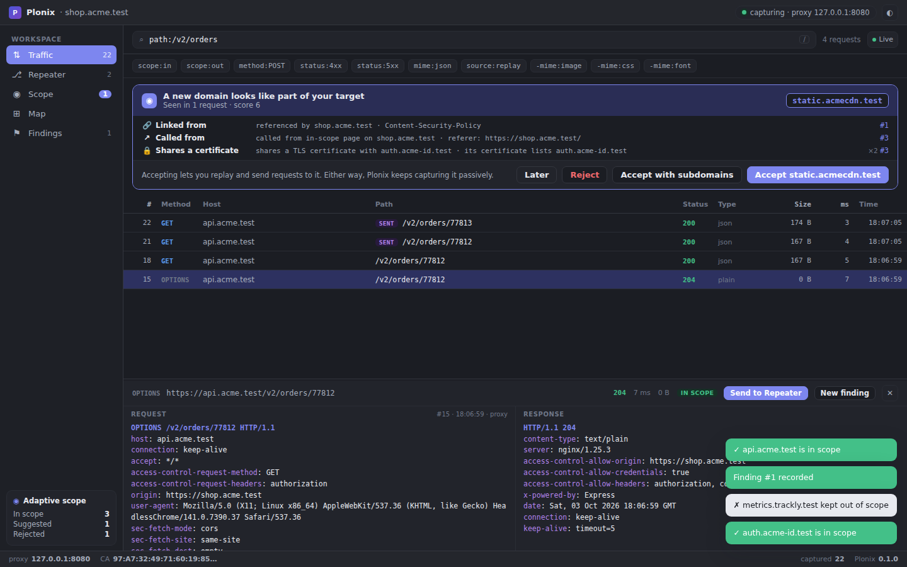

# Plonix

**The open-source web security workbench for macOS. Fast, native, and scriptable from day one.**

Plonix captures everything your browser does, learns the real shape of the target as you explore it, and lets you search, replay and prove what you find, from a GUI, a terminal, or an AI agent.



> **Status: early development.** The core engine (proxy, traffic store, search, adaptive scope, local API), the `plonix` CLI, the Plonix app and read-only MCP access for AI agents work today and are covered by tests. See [Roadmap](#roadmap).

---

## Why Plonix

Most of a web assessment is the same loop: capture traffic, figure out what the app actually is, poke at the interesting parts, and write up what's real. The tools for that loop have grown heavy. Plonix keeps the loop and drops the weight.

| You want | Plonix gives you |
| --- | --- |
| A tool you can afford on every machine | Free and open source. No Pro tier holding back the good parts. |
| Large projects that stay responsive | A Rust engine with one SQLite database per project. Search over captured traffic stays quick as projects grow. |
| Something you can see and click | Plonix.app: a Mac app with its own window, menu bar and Dock icon. Live traffic, the Bench for branching and comparing requests, adaptive scope, a map of the target and findings. |
| Scope that matches reality | Adaptive scope learns related domains as you browse and shows the evidence for each one. |
| Filters you can type | A small query language: `host:api.acme.com method:POST status:5xx -logout`. |
| Automation in any language | Everything goes through a local HTTP API. Use curl, Python, Go, or whatever you already script in. |
| An AI teammate that can see your project | Built-in MCP: `plonix connect claude` lets Claude Code read live traffic, the map, scope and findings. Read-only, enforced by the engine. |

## Principles

- **Fast.** A native Rust core. Projects with lots of traffic stay quick to search.
- **Native.** Built for macOS, not ported to it.
- **Minimal by design.** A few workflows done well: capture, discover, investigate, experiment, validate. No feature you'll never open.
- **User-friendly first.** From download to captured traffic in under a minute is a release requirement.
- **Programmable everywhere.** GUI, CLI and MCP are equal clients of the same local API. Anything you can click, you can script.
- **AI-native.** Agents get first-class, scoped access to the research environment, and they follow the same scope rules you do.

## Tools

Plonix has a handful of tools, each with its own name. They are the same in the window, the CLI and the docs.

| Tool | What it does | From the terminal |
|---|---|---|
| **Traffic** | Every request and response that passes through the proxy, live, with the search language | `plonix search`, `plonix watch` |
| **Lens** | The selected request and its response, decoded and pretty-printed | `plonix show <id>` |
| **Bench** | Where you experiment: edit a request, send it, branch it and compare responses side by side. Each tab is one experiment | `plonix replay <id>` |
| **Scope** | Adaptive scope: the domains Plonix thinks belong to your target, with the evidence, to accept or reject | `plonix scope` |
| **Map** | Hosts, the technologies behind them and their endpoints and parameters | `plonix hosts`, `plonix tech` |
| **Findings** | What you found, with the requests that prove it attached as evidence | the window, or `/api/findings` |
| **Agents** | Which AI agents are connected to the project, what they may do, and how to connect one | `plonix connect claude`, `plonix mcp` |
| **Rules** and the **Store** | Community rule packs that teach Plonix to recognise technologies | `plonix rules`, `plonix store` |

## What works today

### Intercepting proxy with a local CA
- HTTP and HTTPS interception. Plonix creates its own certificate authority on first run and mints per-host certificates on the fly.
- Trust the CA once (`~/.plonix/ca.pem`) and every HTTPS site you visit through the proxy is captured.
- Compressed bodies (gzip, deflate, brotli) are decoded for display and search.

### Full traffic capture
- Every request and response is recorded into a per-project SQLite database, in scope or not, so nothing you browsed is lost.
- Hosts and the endpoints seen on each host are listed for a quick map of the target.

### Fast search with filters
Field filters narrow by metadata, and anything else is full-text matched (case-insensitive) against URLs, headers and decoded bodies. Every term is an include (show only what matches) and a leading `-` makes it an exclude (hide what matches). Separate values with commas to match any of them: `status:4xx,5xx -kind:static -host:cdn.example.com`.

```text
host:example.com          host or any subdomain (globs: host:*.cdn.*)
method:POST               HTTP method
status:404  status:5xx    exact code, class, or status:none for no response
path:/api                 path prefix (globs: path:*admin*)
ext:js                    file extension of the path
kind:static               images, fonts, stylesheets, scripts and media
mime:json                 substring of the response content type
scope:in  scope:out       in or out of the current scope
source:proxy              captured traffic, or source:replay for sent requests
"set-cookie: sid"         quoted phrase
passw -logout             plain full-text terms
```

### Adaptive scope
Static whitelists assume you already know every domain an app uses. You don't. You find out by using it. Plonix records everything, then suggests domains to bring into scope, each backed by evidence:

| Evidence | Example |
| --- | --- |
| Called from an in-scope page | `Referer` or `Origin` points at an in-scope host |
| Redirect | An in-scope host redirects here (`Location:`) |
| Linked | Referenced in an in-scope page or its `Content-Security-Policy` |
| Shares a session | Receives a session token that an in-scope host issued |
| Shares a certificate | Appears in the TLS certificate SANs of an in-scope host, or the reverse |

You accept or reject each suggestion (`*.example.com` covers all subdomains). Accepting a domain re-analyzes past traffic, so new suggestions surface right away.

**Enforcement is built in.** Every active request, whether a replay, a crafted request, or one from an agent, passes a single choke point. If the target host isn't accepted, it is refused. Passive capture keeps recording everything.

### Replay and send
- Replay any captured exchange with a different method, path, headers or body.
- Send new requests from scratch. Results are stored alongside captured traffic and tagged with who sent them.

### Technology detection, maintained by the community
- Plonix recognises what runs behind every host (servers, frameworks, CMSs, CDNs and WAFs, identity providers, exposed admin consoles) and shows the evidence for each detection, down to the exchange.
- Detection is driven by declarative **rule packs** that anyone can write and share. Install them from a file, a URL or the **store**, a JSON index hosted anywhere. New rules apply to traffic you already captured.
- Packs are untrusted data: strictly validated, linear-time patterns only, pinned by SHA-256 and re-verified on load. They can't run code, reach the network or touch scope. See [docs/detection-rules.md](docs/detection-rules.md) and the extension design in [docs/extensions.md](docs/extensions.md).

### The Plonix app
- **Plonix.app** is a Mac app: double-click it and the Plonix window opens with capture running. It starts the engine inside the app (or uses the one already running), signs itself in, and needs no terminal.
- **Open target** (⌘O, or the button at the top of the sidebar) opens the site you are testing in the capture browser: a separate browser with an isolated profile that routes through Plonix and trusts its certificate. The domain and its subdomains go into scope.
- Native menu bar and shortcuts: ⌘1 to ⌘6 switch between Traffic, Bench, Scope, Map, Findings and Agents, ⌃⌘S shows or hides the sidebar. Light and dark follow the system.
- `plonix` commands in a terminal talk to the same engine while the app is open, so scripts and the window always see the same project. Quitting the app stops an engine it started.
- The same window also runs in any browser with `plonix ui`, served by the engine itself.

### The Plonix window
- **Sidebar:** navigation, Open target, the scope suggestions waiting on you (accept or reject in one click) and the hosts in scope with their request counts (click one to filter Traffic). Collapse it to icons with ⌃⌘S, or `\` in a browser.
- **Traffic:** a live-updating request list with the search language and the **Lens**, an inline request/response viewer that decodes gzip/brotli and pretty-prints JSON. A banner surfaces each new domain adaptive scope suggests, with its evidence and one-click accept or reject.
- **Include and exclude filters:** filters sit as chips above the list, under **Show only** and **Hide**. Add one with **+ Filter**, in one click from the suggestions drawn from your traffic (hide static files, hide the busiest third-party hosts, show only errors), or right-click any row to show only or hide its host, path, status class, content type, extension or method. Click a chip to flip it between show and hide, × to remove it. Filters typed in the search box become chips, and **Copy query** gives the same filters as a query for the CLI or the API. Active filters are saved with the project.
- **Spotted in the Lens:** Plonix points out what stands out in a request or response, right above it. JWTs (header and payload decoded, algorithm, expiry; the signature is never claimed valid), Base64, hex and double URL-encoding that decode to readable text, Basic auth credentials, personal data (email addresses, Luhn-valid card numbers), leaked secrets (AWS, Google, GitHub, Slack and Stripe keys, private keys) and internal IP addresses. Click one to highlight it in place and see the decoded value, then copy it or find it across all captured traffic. Nothing is flagged unless it is there, and detection runs locally on traffic you already captured.
- **Bench:** edit any request and send it (press `b` or double-click a row in Traffic), keep a history per tab, restore or branch any earlier send into a new tab, and compare two sends side by side (response or request diff). Sends go through the engine's scope enforcement: out-of-scope hosts are refused, and you can accept the host right there.
- **Scope:** every suggested domain with its evidence, accept (with or without subdomains) or reject, and the rule list.
- **Map:** hosts with their scope state, detected technologies with the evidence behind them, and endpoints with statuses and parameters.
- **Findings:** record a finding from any request, with the requests that prove it linked as evidence.
- **Agents:** which AI agents are connected right now and every request they made, what they are allowed to do, the one command that connects Claude Code, and prompts to try.
- **Suggested filters** come from the traffic you captured: in-scope only, server and client errors, the write methods in use, JSON, the busiest API paths and hosts, requests sent from the Bench, and one chip that hides static files. Each shows how many requests it matches, and a filter only appears when something matches it.
- The page signs in through a one-time link (the app and `plonix ui` create it), so the API token never appears in a URL. It is locked down with a strict Content-Security-Policy, and captured content is only ever rendered as text.

### AI agents over MCP
- `plonix connect claude` adds Plonix to Claude Code as an MCP server. From then on Claude Code can search your captured traffic, read requests and responses, see hosts, endpoints and detected technologies, review scope suggestions and read findings, on the live project.
- Access is **read-only and enforced by the engine**: agents sign in with their own token (`~/.plonix/agent-token`), and anything but reading (sending or replaying requests, changing scope, recording findings) is refused.
- Any other MCP client can run `plonix mcp` as a stdio server. Captured data stays on your machine. See [docs/agents.md](docs/agents.md).

```sh
plonix open example.com      # capture while you browse
plonix connect claude        # once
claude                       # then ask:
```

> Use Plonix to find in-scope API endpoints that returned errors, then read the most interesting request and tell me what stands out.

### Local API
- An HTTP API on loopback only, protected by a bearer token stored at `~/.plonix/api-token` (mode `0600`).
- Requests must target the loopback address, which keeps web pages in your browser from reaching it.

## Quickstart

Requirements: Rust (stable, edition 2024) and a C toolchain. On macOS, `xcode-select --install` is enough. SQLite is bundled.

```sh
git clone https://github.com/SergeyMalych/plonix.git
cd plonix
cargo install --path crates/plonix-cli    # installs the `plonix` command
```

### Plonix for Mac

Build and open the app (needs the Rust toolchain above):

```sh
cargo install tauri-cli --version "^2" --locked   # once
cd crates/plonix-app
cargo tauri build --bundles app
open ../../target/release/bundle/macos/Plonix.app
```

Drag `Plonix.app` to Applications to keep it. While developing, `cargo run -p plonix-app` opens the same window without bundling.

Each CI run on `main` and on pull requests also builds `Plonix.app` and attaches it as a download (`Plonix-macOS`). These builds are not signed yet: the first time, right-click the app and choose **Open**, or run `xattr -dr com.apple.quarantine Plonix.app`.

### The first 60 seconds from a terminal

```sh
plonix open example.com
```

That one command creates your local certificate authority (first run only), starts the engine in the background, puts `example.com` and its subdomains in scope, opens a browser at the target with capture running, and opens the Plonix window next to it:

```text
Plonix · https://example.com/

  ✓ Certificate  ~/.plonix/ca.pem  (created)
  ✓ Proxy        127.0.0.1:8080  (started, project example.com)
  ✓ Scope        example.com (+ subdomains)  (more domains are suggested as you browse)
  ✓ Browser      Google Chrome (isolated profile, trusts Plonix)
  ✓ Window       http://127.0.0.1:8090  (opened in your default browser)

Capturing. Browse the site; requests appear below. Ctrl-C stops watching, capture keeps running.
```

The browser is Chrome, Brave, Edge or Chromium with its own isolated profile. It routes through the proxy and trusts the Plonix certificate on its own, so HTTPS works with nothing to install. Firefox is used when no Chromium-based browser is found. Set `PLONIX_BROWSER` to pick a specific browser.

To capture HTTPS from other apps too (Safari, curl, your everyday browser), trust the certificate once with `plonix ca trust`. It is added to your login keychain, and macOS asks you to confirm.

Browse the site and watch requests arrive in the Plonix window. Closed it? `plonix ui` opens it again (and starts the engine if it is not running). `plonix ui --no-open` prints the one-time link instead, and `plonix open --no-ui` skips the window.

### Working from the terminal

```sh
plonix status                              # is it running, what has it captured
plonix search host:example.com status:5xx  # newest first; filters below
plonix show 42                             # one request and its response
plonix watch scope:in                      # print new traffic as it arrives
plonix hosts                               # every host seen, busiest first
plonix tech                                # technologies detected on each host, with evidence

plonix scope                               # rules, plus suggested domains with evidence
plonix scope review                        # decide on suggestions one by one
plonix scope accept '*.example-cdn.com'    # or: reject, remove

plonix replay 42 -H 'Authorization: Bearer other-user' -t '/api/users/2'

plonix rules                               # detection rule packs in effect
plonix rules add ./my-pack.json            # or an https:// URL, optionally --sha256
plonix store                               # browse community packs
plonix store install admin-panels          # verified against the store's sha256
plonix stop                                # captured traffic is kept
```

Replays only go to accepted hosts. Anything else is refused with exit code 4 and a hint to accept the host first. Every command takes `--json` for scripting. Exit codes are `0` ok, `1` error, `2` bad usage or query, `3` engine not running, `4` refused by scope, `5` not found.

`plonix start` runs the engine without opening a browser (`--project`, `--port`, `--insecure-upstream` for self-signed staging hosts). Data lives in `~/.plonix`, or `$PLONIX_HOME`.

### Using the local API directly

Everything the CLI does goes through the local API, so any language can drive Plonix:

```sh
TOKEN=$(cat ~/.plonix/api-token)
API=http://127.0.0.1:8090/api

curl -H "Authorization: Bearer $TOKEN" "$API/status"
curl -H "Authorization: Bearer $TOKEN" -G "$API/traffic" --data-urlencode 'q=host:example.com status:2xx'
curl -H "Authorization: Bearer $TOKEN" "$API/scope"     # rules plus suggestions with evidence

curl -H "Authorization: Bearer $TOKEN" -H 'Content-Type: application/json' \
     -d '{"domain":"*.example.com"}' "$API/scope/accept"
```

The API listens on port 8090 when it is free; `plonix status` shows the actual address.

### API at a glance

| Method | Path | What it does |
| --- | --- | --- |
| GET | `/` | The Plonix window (static page; signs in with a one-time link) |
| POST | `/api/ui/launch` | Create a one-time link that opens the window signed in |
| POST | `/api/browser/open` | Open a target in the capture browser (`{"target": "example.com"}`), accepting it into scope |
| GET | `/api/status` | Engine, project and CA info, counts |
| GET | `/api/traffic?q=&limit=&offset=` | Search captured traffic |
| GET | `/api/traffic/facets` | What recent traffic contains (methods, status classes, content kinds, in-scope hosts and paths), for suggested filters |
| GET | `/api/traffic/{id}` | One exchange, with decoded bodies |
| GET | `/api/traffic/{id}/insights` | What stands out in one exchange: tokens to decode, personal data, secrets |
| GET | `/api/hosts` | Hosts seen |
| GET | `/api/hosts/{host}/endpoints` | Endpoints seen on a host |
| GET | `/api/tech` · `/api/tech/{host}` | Detected technologies per host, with evidence |
| GET | `/api/rules` | Detection rule packs in effect |
| GET | `/api/scope` | Scope rules and pending suggestions |
| POST | `/api/scope/accept` · `reject` · `remove` | Decide on a domain |
| POST | `/api/send` | Send a new request (in-scope hosts only) |
| POST | `/api/replay` | Replay a captured exchange, optionally modified |
| GET / POST | `/api/findings` | List or record findings |
| GET | `/api/agents` | What agents may do, and which agents are connected |
| POST | `/api/shutdown` | Stop the engine |

## Architecture

```text
        GUI        CLI        MCP          equal clients
          \         |         /
           └──── Local API ──┘             loopback + token
                    │
               Core Engine                 Rust, headless
        ┌───────────┼───────────┐
     Traffic    Discovery    Findings
     (proxy,    (adaptive     (validated,
      store,     scope, tech   reproducible)
      search)    detection)
                    ▲
          rule packs · store       untrusted, declarative, verified
```

The engine is a headless background process. Every front end talks to it the same way, so the Mac app, your shell scripts and your AI agent always see the same project.

```text
crates/
├── plonix-core   engine: proxy, CA, store, search, scope, detection, rule packs, store index, local API
│   └── ui/       the Plonix window: plain HTML, CSS and JavaScript embedded in the binary
├── plonix-cli    the `plonix` command: engine control, onboarding, search, scope, replay, rules, store, MCP server
└── plonix-app    Plonix.app: the window as a desktop app, with the engine built in
store/            community store: index.json and rule packs
docs/             detection rules, agents and MCP, extension design
```

## Roadmap

**Built**
- [x] Intercepting HTTP/HTTPS proxy with local CA
- [x] Traffic capture into SQLite, decoded bodies
- [x] Search language with field filters
- [x] Adaptive scope v1: suggestions with evidence, accept/reject, enforcement
- [x] Replay and send
- [x] Token-authenticated, loopback-only local API
- [x] `plonix` CLI: search, inspect, watch, replay and manage scope from the terminal
- [x] `plonix open <target>`: one command from nothing to captured traffic, in a pre-configured browser
- [x] Technology detection from community rule packs, with a store (`plonix tech`, `plonix rules`, `plonix store`)
- [x] The Plonix window (`plonix ui`): live traffic, the Bench with branch and compare, adaptive scope review, map with technologies, findings
- [x] Plonix.app for macOS: the window as a desktop app with the engine built in, Open target from the app, native menu bar
- [x] Read-only MCP server (`plonix mcp`), `plonix connect claude` and the Agents screen

**Coming**
- [ ] Opt-in active mode for agents: replay and send within accepted scope, switched on by you ([design](docs/agents.md#later-an-opt-in-active-mode))
- [ ] Signed and notarized app downloads
- [ ] Sandboxed WebAssembly extensions with a closed capability list that can never bypass scope ([design](docs/extensions.md))

Deliberately out of scope: automated vulnerability scanning and token-randomness analysis. Plonix stays small on purpose.

## Contributing

Plonix is early, and this is a good time to shape it. Issues and discussions about workflows, pain points and design are as valuable as code.

1. Open an issue describing the problem or idea before large changes.
2. Keep pull requests focused, and include tests for engine behavior.
3. Run `cargo fmt`, `cargo clippy --workspace` and `cargo test --workspace` before pushing.

The easiest way to contribute is a **detection rule pack**: no Rust needed. Write one, check it with `plonix rules check`, and open a pull request that adds it to `store/`. See [docs/detection-rules.md](docs/detection-rules.md#contributing-a-pack).

Use Plonix only against systems you are authorized to test.

## License

To be announced.
